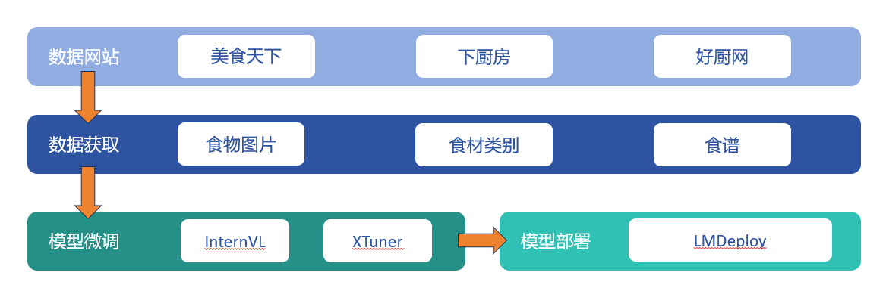

# 基于InternLM的中华食谱大模型🍲

<div align="center">
  
  <br /><br />
</div>

Logo由[MidJourney](https://huggingface.co/spaces/mukaist/Midjourney)生成。

## 🚩目录

- [🚩目录](#目录)
- [🍳项目简介](#项目简介)
- [🛠️技术架构](#技术架构)
- [📺Demo](#Demo)
- [💻使用指南](#使用指南)
  - [1. 数据准备](#1-数据准备)
  - [2.  指令数据微调](#2-指令数据微调)
  - [3. 可视化](#3-可视化)
  - [4. LMDeploy部署](#4-LMDeploy部署)
- [😄更新说明](#更新说明)
- [😰遇到的问题](#遇到的问题)
- [😘鸣谢](#鸣谢)


## 🍳项目简介

日常生活中，当我们看到一道美味的菜肴时，我们可能也想尝试去做这道菜，但是我们不知道它的具体流程。

本项目名为中华食谱大模型，旨在根据用户提供的食物图片为用户提供合适的食谱，帮助用户更好地做菜，降低做菜的门槛。

我们基于网上搜集到的食谱数据，构建一个食谱多模态大模型，我们期望它能达到以下效果：

- 根据图片生成食谱
- 根据食品名称生成食谱
- 食品识别
- 饮食推荐
- 利用RAG技术从网上检索数据

## 🛠️技术架构

目前项目主要基于上海人工智能实验室的开源模型InternVL2-2B，4B，8B模型，使用的数据来自美食天下，下厨房等食谱网站，通过爬取它们的数据集构建用于模型训练的指令微调数据集。使用XTuner对模型进行Lora微调，后续计划结合langchain实现RAG检索增强的效果，可视化界面使用streamlit实现。项目框架图如下：



## 📺Demo

项目讲解视频：[B站](https://www.bilibili.com/video/BV1YuWCeFEdc/?vd_source=7ebf2c374f0af4b51d940d164ecffcf7)

<video width="320" height="240" controls>   <source src="doc/demo.mp4" type="video/mp4">   Your browser does not support the video tag. </video>

## 💻使用指南

### 1. 数据准备

- 从[美食天下](https://www.meishichina.com/)爬取食谱网站：```python data_url_data.py```
- 从爬取的食谱网站下载数据，包括图片，食材，步骤：```python download_data.py```
- 因为有些图片无法使用，对数据进行一次过滤：```python filter_data.py```
- 生成指令微调数据集，根据图片回答名称、食材、食谱：```python construct_instruct_data.py```
### 2. 指令数据微调
（1）首先下载对应的模型：
```python
import os

# 设置环境变量
os.environ['HF_ENDPOINT'] = 'https://hf-mirror.com'

# 下载模型
os.system('huggingface-cli download --resume-download OpenGVLab/InternVL2-2B --local-dir /root/model/InternVL2-2B')

```
（2）然后复制对应的配置文件：
```shell
xtuner copy-cfg internvl_v2_internlm2_2b_lora_finetune.py
```

（3）然后修改配置文件信息，主要修改要微调的模型以及数据集位置：
```python
path = '/root/model/InternVL2-2B'

# Data
data_root = '/root/data/MeiShiTianXia/'
data_path = data_root + 'instruction_dataset.json'
image_folder = data_root
```
（4）然后执行微调命令：
```shell
NPROC_PER_NODE=1 xtuner train 配置文件 --deepspeed deepspeed_zero1
```

（5）最后合并Lora权重：
```
python3 /root/Project/InternLM/code/XTuner/xtuner/configs/internvl/v1_5/convert_to_official.py ./internvl_v2_internlm2_4b_lora_finetune_copy.py /root/Project/ReceipeLLM/work_dirs/internvl_v2_internlm2_4b_lora_finetune_copy/iter_8500.pth /root/Project/ReceipeLLM/InternVL2-4B-Receipe/
```

使用xtuner convert merge会报错。

### 3. 可视化
使用命令```streamlit run web_demo.py```，界面如下：


### 4. LMDeploy部署
（1）启动API服务器：
```shell
lmdeploy serve api_server \
    /root/Project/ReceipeLLM/InternVL2-2B-Receipe \
    --model-format hf \
    --quant-policy 0 \
    --server-name 0.0.0.0 \
    --server-port 23333 \
    --tp 1
```
（2）然后以Gradio网页形式连接API服务器：
```shell
lmdeploy serve gradio http://localhost:23333 \
    --server-name 0.0.0.0 \
    --server-port 6006
```

也可以直接使用如下命令部署：
```shell
lmdeploy serve gradio /root/Project/ReceipeLLM/InternVL2-2B-Receipe --cache-max-entry-count 0.1
```
需要注意的是部署的4B模型没有上传图片按钮，2B模型有。

## 😄更新说明

- 8.16：使用2887条食品图像-文本数据进行微调
- 8.23：使用6794条食品图像-文本数据进行微调InternVL2-4B，推理速度比较慢
- 8-31：加了文本的数据微调InternVL2-8B，推理速度很快，但感觉效果跟4B差不多，但会出现重复回复的现象，可能过拟合了
- 9-3：加了文本的数据微调InterVL2-26B，推理速度也可以，但显存消耗大，效果也可以
- 9-27: 支持[ChatTTS](https://huggingface.co/2Noise/ChatTTS)实现文本转语音（TTS），[FunASR](https://huggingface.co/FunAudioLLM/SenseVoiceSmall)实现语音转文本（ASR）

如果你想加一些颜文字，可以看这个网址：[地址](https://www.emojiall.com/zh-hans/emoji/%F0%9F%91%A8%F0%9F%8F%BF%E2%80%8D%F0%9F%8D%B3)

## 😰遇到的问题
1、使用InternVL2-4B微调的模型进行推理时报错RuntimeError: shape '[-1, 0]' is invalid for input of size 77，但是InternVL2-2B不会，这确实是一个存在的问题：[Issue](https://www.modelscope.cn/models/OpenGVLab/InternVL2-4B/feedback/issueDetail/13820)

解决办法：跟换transformers版本：transformers 4.37.2，[参考链接](https://github.com/OpenGVLab/InternVL/issues/405)

2、4B模型生成过程会输出�，不稳定，且推理速度慢

3、2B、4B模型不能准确识别食品种类，事实上，2B，4B，8B的视觉模型都是一样的

4、多卡：Error: mkl-service + Intel(R) MKL: MKL_THREADING_LAYER=INTEL is incompatible with libgomp.so.1 library

```
export MKL_THREADING_LAYER=GNU
```

5、LMdeploy报错：RuntimeError: Current event loop is different from the one bound to loop task

这个要等lmdeploy更新了，看能不能解决掉这个bug

6、ChatTTS加载特定音色报错'Chat' object has no attribute '_encode_epk_emb'

使用ChatTTS最新的源代码，然后解压，而不是pip

## 😘鸣谢

如果你也想做大模型，可以来这里了解：[书生浦语项目](https://github.com/InternLM/Tutorial)
